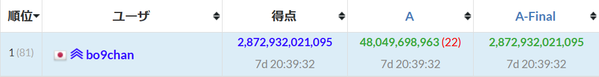
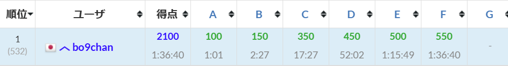

# AtCoder Standings AC Time Formatter

## 概要

 AtCoderのコンテスト順位表に表示されるAC時間を見やすくフォーマットします。

#### 表示例1
 

#### 表示例2
 

## 機能

 - 時間が60分未満のとき：  
 "分：秒" 形式で表示します。
 - 時間が60分以上24時間未満のとき：  
 "時：分：秒" 形式で表示します。
 - 時間が24時間以上のとき：  
 "日d　時：分：秒" 形式で表示します。

## インストール

以下のリンク先（Greasy Fork）よりインストールしてください。Tampermonkey等のユーザースクリプトマネージャーが必要です。

[AtCoder Standings AC Time Formatter](https://greasyfork.org/ja/scripts/523392-atcoder-standings-ac-time-formatter)

